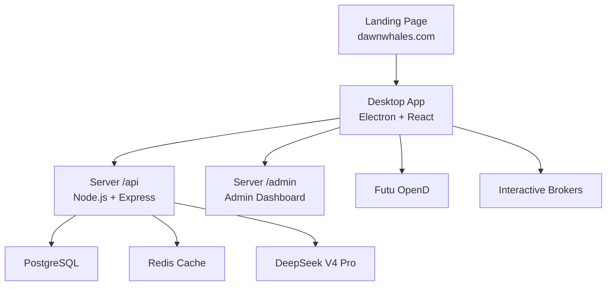
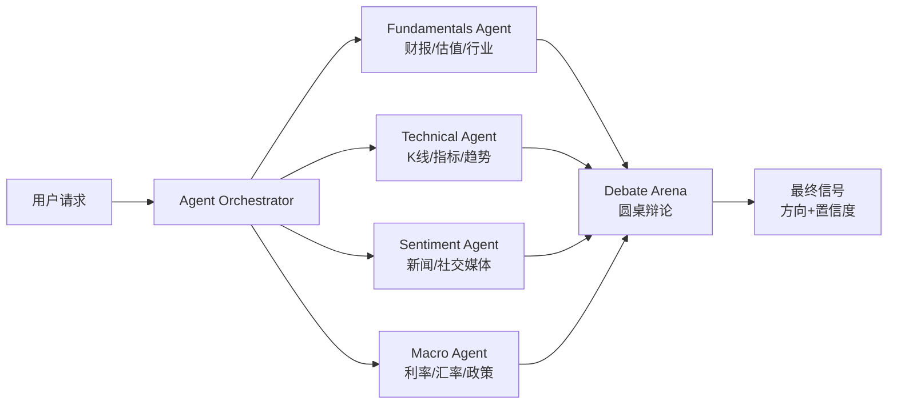
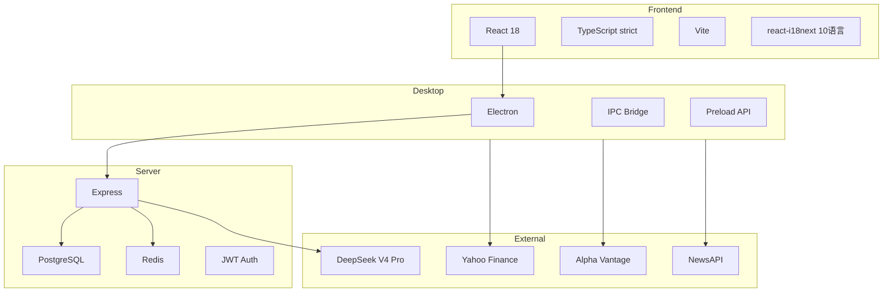

# DAWN WHALES 架构文档

**版本**: v1.9.0 GA | **更新**: 2026-06-10

---

## 系统总览



---

## 三产品架构

| 产品 | 技术 | 职责 |
|------|------|------|
| 落地页 | 静态 HTML + Vite + PostCSS | 产品介绍、下载、注册入口 |
| 桌面端 | Electron + React + TypeScript | 策略创建/回测/AI/交易/钱包/社区 |
| 服务端 | Node.js + Express + PostgreSQL + Redis | AI Gateway / 计费 / 钱包 / P2P / 2FA / Admin |

---

## 4Agent AI 架构



### 数据流

```
用户输入 → Orchestrator → 4 Agent 并行分析
    ↓
各 Agent 调用数据源 (Yahoo/AlphaVantage/NewsAPI/Reddit/东方财富)
    ↓
结果汇总 → Debate Arena (3轮辩论)
    ↓
Arena 投票 → 最终信号 (BUY/SELL/HOLD + 置信度)
    ↓
信号推送 → Strategy Engine → Trade Executor → Broker
```

---

## 引擎目录结构

```
electron/engine/
├── agents/          # 4Agent AI
├── analysis/        # 因子/分析/评分
├── backtest/        # 回测/蒙特卡洛/前向
├── core/            # 核心引擎 (交易/执行/调度)
├── data/            # 数据源/适配器/聚合
├── factors/         # 因子计算/兼容
├── portfolio/       # 组合/风险/再平衡
└── risk/            # 风控/熔断/监控
```

---

## 技术栈



---

## 安全架构

| 层级 | 措施 |
|------|------|
| AI Key | DeepSeek API Key 仅在服务器暴露 |
| 通信 | HTTPS + TLS 1.3 + JWT (1h) |
| 输入 | DOMPurify XSS sanitize + 参数化 SQL |
| CSRF | Token Header + SameSite Cookie |
| CSP | Content-Security-Policy header |
| 沙箱 | child_process 输入校验 + 30s kill |
| 审计 | append-only audit trail |
| 日志 | 脱敏 (API Key → `sk-***`) |

---

## 数据流

```
用户 → 桌面端 (Electron)
    ↓ IPC
Strategy Engine → Backtest Engine → 信号
    ↓
Trade Executor → Broker (OpenD/IBKR)
    ↓
Position Monitor → Risk Engine → 风控检查
    ↓
PnL Calculator → Wallet → USDT 结算
```

---

## 部署架构

```
                     ┌─────────────────┐
                     │   CDN / Nginx   │
                     │ dawnwhales.com  │
                     └────────┬────────┘
                              │
        ┌─────────────────────┼─────────────────────┐
        │                     │                     │
  ┌─────▼─────┐       ┌──────▼──────┐       ┌──────▼──────┐
  │  Landing  │       │  Desktop    │       │   Server    │
  │  Static   │       │  Win/Mac/   │       │  /api:3001  │
  │  HTML     │       │  Linux      │       │  /admin:3002│
  └───────────┘       └─────────────┘       └──────┬──────┘
                                                   │
                                          ┌────────┼────────┐
                                          │        │        │
                                    ┌─────▼──┐ ┌──▼───┐ ┌─▼──────┐
                                    │  PG 15 │ │Redis │ │DeepSeek│
                                    └────────┘ └──────┘ └────────┘
```

---

**v1.9.0 GA · 31 轮 · 5 虾 · Production Ready**
